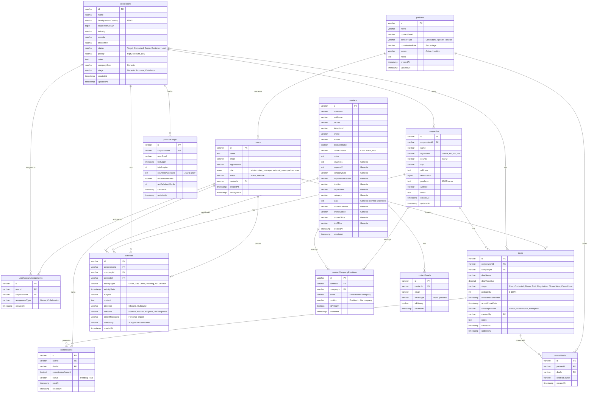

# FRIDAY CRM - Datenbankschema

## Entity Relationship Diagram



## Tabellen-Übersicht

### Hierarchie (Konzern → Firma → Ansprechpartner)

| Tabelle | Zweck | Anzahl Felder |
|---------|-------|---------------|
| **corporations** | Konzerne (z.B. Saint-Gobain) | 13 |
| **companies** | Firmen innerhalb Konzern (z.B. Saint-Gobain Deutschland GmbH) | 11 |
| **contacts** | Ansprechpartner (können mehreren Firmen zugeordnet sein) | 21 |
| **contactCompanyRelations** | N:M Beziehung Contact ↔ Company | 6 |
| **contactEmails** | Mehrere E-Mails pro Kontakt | 5 |

### Sales & CRM

| Tabelle | Zweck | Anzahl Felder |
|---------|-------|---------------|
| **deals** | Sales Pipeline | 13 |
| **activities** | E-Mails, Calls, Meetings | 12 |
| **productUsage** | GBM Nutzungsdaten | 9 |

### User Management & Permissions

| Tabelle | Zweck | Anzahl Felder |
|---------|-------|---------------|
| **users** | Benutzer (admin, sales_manager, external_sales, partner) | 8 |
| **userAccountAssignments** | Zuordnung User → Corporation | 4 |

### Partner & Commissions

| Tabelle | Zweck | Anzahl Felder |
|---------|-------|---------------|
| **partners** | Externe Partner (Berater, Agenturen) | 8 |
| **partnerDeals** | Partner-Deal-Zuordnung | 4 |
| **commissions** | Provisionen für externe Sales | 6 |

## Genesis World CRM Felder

### Corporations
- `companySize` - Unternehmensgröße
- `stage` - Producer, Distributor, etc.

### Contacts (12 neue Felder)
- `keyword1`, `keyword2` - Suchbegriffe
- `companySize` - Firmengröße
- `responsiblePerson` - Verantwortliche Person
- `function` - Funktion (z.B. GL = Geschäftsleitung)
- `department` - Abteilung
- `category` - Kategorie (z.B. Kunde)
- `tags` - Comma-separated Tags
- `phoneBusiness`, `phoneMobile`, `phoneOffice` - Verschiedene Telefonnummern
- `faxOffice` - Fax-Nummer

## Indizes

### Performance-Optimierung

```sql
-- Corporations
CREATE INDEX corporations_name_idx ON corporations(name);
CREATE INDEX corporations_status_idx ON corporations(status);

-- Companies
CREATE INDEX companies_corporation_idx ON companies(corporationId);
CREATE INDEX companies_name_idx ON companies(name);

-- Contacts
CREATE INDEX contacts_name_idx ON contacts(lastName, firstName);

-- Contact Relations
CREATE INDEX ccr_contact_idx ON contact_company_relations(contactId);
CREATE INDEX ccr_company_idx ON contact_company_relations(companyId);

-- Contact Emails
CREATE INDEX contact_emails_contact_idx ON contact_emails(contactId);
CREATE INDEX contact_emails_email_idx ON contact_emails(email);

-- Deals
CREATE INDEX deals_corporation_idx ON deals(corporationId);
CREATE INDEX deals_stage_idx ON deals(stage);
CREATE INDEX deals_created_by_idx ON deals(createdBy);

-- Activities
CREATE INDEX activities_corporation_idx ON activities(corporationId);
CREATE INDEX activities_contact_idx ON activities(contactId);
CREATE INDEX activities_date_idx ON activities(activityDate);

-- Product Usage
CREATE INDEX product_usage_corporation_idx ON product_usage(corporationId);
```

## API-Endpunkte (tRPC)

### Corporations
- `corporations.list` - Liste aller Konzerne
- `corporations.get` - Einzelner Konzern
- `corporations.create` - Neuer Konzern
- `corporations.update` - Konzern bearbeiten

### Companies
- `companies.listByCorporation` - Firmen eines Konzerns
- `companies.get` - Einzelne Firma
- `companies.create` - Neue Firma
- `companies.update` - Firma bearbeiten ✨ NEU

### Contacts
- `contacts.listByCompany` - Kontakte einer Firma
- `contacts.get` - Einzelner Kontakt
- `contacts.create` - Neuer Kontakt
- `contacts.update` - Kontakt bearbeiten ✨ NEU

### Deals
- `deals.list` - Alle Deals des Users
- `deals.listByCorporation` - Deals eines Konzerns
- `deals.create` - Neuer Deal

### Activities
- `activities.listByCorporation` - Aktivitäten eines Konzerns
- `activities.create` - Neue Aktivität

## Datentypen

| Typ | Verwendung | Beispiel |
|-----|------------|----------|
| `varchar(64)` | IDs | UUID |
| `varchar(255)` | Namen, URLs | "Saint-Gobain Group" |
| `text` | Lange Texte | Notizen, JSON |
| `bigint` | Große Zahlen | Umsatz in EUR |
| `decimal(10,2)` | Geldbeträge | Deal Value |
| `int` | Zähler | Probability (0-100) |
| `boolean` | Ja/Nein | decisionMaker |
| `timestamp` | Zeitstempel | createdAt |
| `enum` | Feste Werte | role, status |

## Migration

Alle Felder sind in Datenbank vorhanden:
```bash
pnpm db:push
```

Status: ✅ Erfolgreich durchgeführt

---

**Version:** ca65c60b  
**Erstellt:** 2025-10-21  
**Tabellen:** 13  
**Gesamt-Felder:** 147

